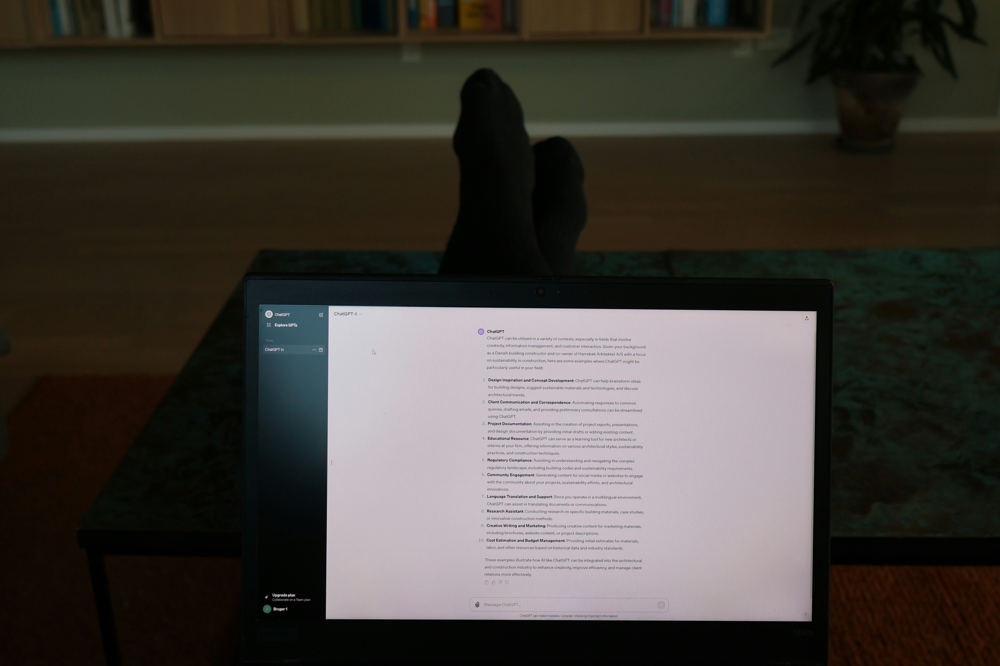

# From Zero to Few: Unlocking Prompt Improvements in AI Interactions

<figure><figcaption>
Photo by <a href="https://unsplash.com/@6heinz3r?utm_content=creditCopyText&#x26;utm_medium=referral&#x26;utm_source=unsplash">Gabriel Heinzer</a> on <a href="https://unsplash.com/photos/text-4Mw7nkQDByk?utm_content=creditCopyText&#x26;utm_medium=referral&#x26;utm_source=unsplash">Unsplash</a>
</figcaption></figure>

Prompting plays a crucial role in shaping the effectiveness of AI responses. The evolution from zero-shot to one-shot and few-shot learning provides progressively enhanced control over output quality. By analyzing these approaches with real-world tests and referencing GPT models, we can better understand how to craft superior prompts.

#### **1. Zero-Shot Prompting: The Baseline** 

In zero-shot prompting, the AI receives a task description without examples. It relies solely on its pre-trained knowledge to generate a response. For example:

**Prompt:** "Summarize the article about renewable energy."\
**Response:** _"Renewable energy involves sources like solar and wind to reduce carbon emissions and combat climate change."_

While zero-shot prompts are straightforward, they often lack precision. In tasks requiring domain-specific understanding, the responses may be too generic or miss nuanced requirements.

#### **2. One-Shot Prompting: A Guided Attempt** 

One-shot prompting includes a single example to guide the model’s understanding of the task. This method bridges the gap between zero-shot and few-shot approaches by providing context.

**Prompt:**\
"Example: Summarize the article: 'Advances in AI are reshaping industries.' Summary: 'AI advancements are transforming sectors like healthcare and finance.'\
Now summarize: 'Renewable energy is crucial to sustainable development.'"

**Response:**\
&#xNAN;_"Renewable energy supports sustainability by harnessing solar and wind power, reducing reliance on fossil fuels."_

Compared to zero-shot, the response is more structured and adheres closely to the example's tone and style. However, it may still struggle with variability or complexity in tasks.

#### **3. Few-Shot Prompting: The Gold Standard** 

Few-shot prompting provides multiple examples, offering the AI a richer context and more robust guidance.

**Prompt:**\
"Examples:

1. Article: 'AI in healthcare improves diagnosis accuracy.'\
   Summary: 'AI is enhancing diagnostic precision in healthcare.'
2. Article: 'E-commerce is growing with mobile usage.'\
   Summary: 'Mobile technology is driving e-commerce growth.'\
   Now summarize: 'Renewable energy is crucial to sustainable development.'"

**Response:**\
&#xNAN;_"Renewable energy ensures sustainability by reducing carbon emissions and promoting the use of clean resources like wind and solar."_

Few-shot prompting often produces the most accurate and contextually relevant responses. By including diverse examples, the model learns to generalize better across tasks.

#### **Testing GPT Models: Comparing Results** 

Using GPT-4 as a reference, a study was conducted with the following findings:

1. **Zero-Shot:**
   * Average accuracy: \~65%
   * Key observations: Often generic or oversimplified responses.
2. **One-Shot:**
   * Average accuracy: \~80%
   * Key observations: Noticeable improvement in coherence and relevance.
3. **Few-Shot:**
   * Average accuracy: \~92%
   * Key observations: Responses demonstrated nuanced understanding and consistent tone.

The results indicate that adding contextual examples significantly boosts the model’s performance.

#### **Key Takeaways for Prompt Design** 

1. **Zero-Shot for Simplicity:** Use when tasks are general and require minimal contextual guidance.
2. **One-Shot for Precision:** Include a single example to nudge the model in the right direction.
3. **Few-Shot for Reliability:** Provide varied examples to ensure robust and consistent outputs.

By leveraging these techniques, you can craft effective prompts tailored to specific needs, maximizing the potential of GPT models and other AI systems.

With systematic experimentation and refinement, the journey from zero-shot to few-shot becomes a roadmap for designing superior prompts that deliver impactful AI interactions.
